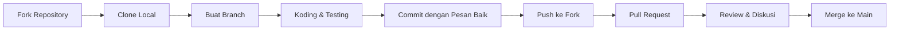

# 🌟 Panduan Berkontribusi

<div align="center">


</divjadwal-sholat-digital-sholat-digital-sholat-digitalWebsite Jadwal Sholat Digital Mushola Al-Ikhlas Pekunden

*"Bersama membangun teknologi untuk kemudahan ibadah"*

---

## 🕌 **Salam Pembuka**

Assalamu'alaikum Warahmatullahi Wabarakatuh,

Terima kasih atas ketertarikan Anda untuk berkontribusi pada proyek **Website Jadwal Sholat Digital Mushola Al-Ikhlas Pekunden**. Proyek ini adalah **wakaf digital** yang bertujuan membantu umat dalam menunaikan ibadah tepat waktu.

Setiap kontribusi, sekecil apapun, adalah **amal jariyah** yang pahalanya terus mengalir. Mari bersama-sama membuat proyek ini lebih bermanfaat!

---

## 🎯 **Filosofi Kontribusi**

### **Prinsip Dasar:**
1. **Niat Ikhlas** - Untuk Allah dan kemaslahatan umat
2. **Kualitas Kode** - Setiap baris kode adalah ibadah
3. **Kolaborasi Santun** - Bermuamalah dengan baik
4. **Dokumentasi Lengkap** - Memudahkan penerus

### **Slogan Kami:**
> *"Kode yang rapi seperti shaf sholat, fungsi yang presisi seperti waktu-waktu mustajab"*

---

## 📋 **Jenis Kontribusi yang Dibutuhkan**

### **🏆 Prioritas Tinggi:**
| Area | Deskripsi | Skill Level |
|------|-----------|-------------|
| **🌙 Integrasi Data** | Update jadwal sholat tahun 2031+ | Intermediate |
| **📱 PWA Enhancement** | Offline capabilities improvement | Advanced |
| **🔔 Notifikasi** | Cross-browser compatibility | Intermediate |

### **✨ Kontribusi Umum:**
| Kategori | Contoh |
|----------|---------|
| **🐛 Bug Fix** | Perbaikan bug yang ditemukan |
| **💡 Fitur Baru** | Ide kreatif untuk kemudahan ibadah |
| **📚 Dokumentasi** | Perbaikan README, komentar kode |
| **🎨 UI/UX** | Desain yang lebih islami & user-friendly |
| **🌐 Translation** | Terjemahan ke bahasa daerah |
| **🧪 Testing** | Testing di berbagai device |

### **👶 Untuk Pemula:**
- Perbaikan typo
- Optimasi gambar
- CSS improvements
- Validasi HTML/CSS
- Aksesibilitas dasar

---

## 🚀 **Mulai Berkontribusi**

### **Step 1: Persiapan**
1. **Fork repository** ke akun GitHub Anda
2. **Clone lokal:**
   ```bash
   git clone https://github.com/Proyek/Jadwal-Sholat-Al-Ikhlas-.git
   cd jadwal-sholat-digital
   ```

### **Step 2: Setup Lingkungan**
Proyek ini murni **HTML/CSS/JS vanilla**, jadi tidak butuh build tools kompleks:

```bash
# Struktur proyek:
jadwal-sholat-digital/
├── index.html          # Entry point
├── assets/            # CSS, JS, images
├── data/              # JSON jadwal
├── manifest.json      # PWA config
└── service-worker.js  # PWA service
```

**Live Server Testing:**
```bash
# Install live server global
npm install -g live-server

# Jalankan di port 8080
live-server --port=8080
```

### **Step 3: Buat Branch**
```bash
# Format: type/deskripsi-singkat
git checkout -b feature/notifikasi-improvement
# atau
git checkout -b fix/bug-countdown
# atau
git checkout -b docs/update-readme
```

**Conventional Branch Names:**
- `feature/` - Untuk fitur baru
- `fix/` - Untuk perbaikan bug
- `docs/` - Untuk dokumentasi
- `style/` - Untuk perubahan UI/CSS
- `refactor/` - Untuk restrukturisasi kode
- `test/` - Untuk testing

---

## 📝 **Standar Koding**

### **1. Struktur Kode HTML**
```html
<!-- Komentar dalam Bahasa Indonesia -->
<section id="jadwal-bulanan" class="islamic-card" 
         aria-labelledby="judul-jadwal-bulanan" 
         data-module="jadwal-module">
  <!-- Gunakan semantic HTML -->
</section>
```

### **2. Style CSS (BEM Methodology)**
```css
/* Block */
.jadwal-table { }

/* Element */
.jadwal-table__header { }
.jadwal-table__row { }

/* Modifier */
.jadwal-table--ramadan { }
.jadwal-table__row--active { }
```

### **3. JavaScript (ES6+ Standards)**
```javascript
/**
 * @function hitungCountdownSholat
 * @description Menghitung countdown ke sholat berikutnya
 * @param {string} waktuSholat - Waktu sholat dalam format HH:MM
 * @returns {string} Countdown dalam format HH:MM:SS
 * @author Nama Kontributor
 */
const hitungCountdownSholat = (waktuSholat) => {
  // Gunakan arrow functions
  // Gunakan const/let, bukan var
  // Comment dalam Bahasa Indonesia
};
```

### **4. Konvensi Penamaan**
```javascript
// Variable: camelCase
const waktuSholatBerikutnya = '12:30';

// Constant: UPPER_SNAKE_CASE
const WAKTU_DHUHA = '08:00';

// Function: camelCase dengan kata kerja
function updateJadwalHariIni() { }

// Class: PascalCase
class PrayerTimeManager { }

// File: kebab-case
// export-pdf.js
// audio-manager.js
```

### **5. Komentar & Dokumentasi**
```javascript
/**
 * MODULE: Ekspor Jadwal
 * ---------------------
 * Modul untuk mengekspor jadwal ke PDF, Excel, dll.
 * 
 * @author Reyzar Alansyah Putra
 * @version 1.2.0
 * @since 2025-01-01
 * 
 * @example
 * eksporKePDF('Maret', 2025);
 */
```

---

## 🔧 **Workflow Pengembangan**

### **Alur Kontribusi:**


### **Commit Message Convention:**
```
tipe(scope): pesan singkat

body (opsional)

footer (opsional)

Contoh:
feat(notifikasi): tambah notifikasi browser untuk adzan

fix(export): perbaikan bug export PDF halaman kosong

docs(readme): update instruksi instalasi
```

**Tipe yang diizinkan:**
- `feat` - Fitur baru
- `fix` - Perbaikan bug
- `docs` - Perubahan dokumentasi
- `style` - Formatting, missing semi colons, etc
- `refactor` - Kode refactoring
- `test` - Menambah atau memperbaiki test
- `chore` - Perubahan build process, tools, etc

---

## 🧪 **Testing Guidelines**

### **Testing Mandatori Sebelum PR:**
1. **Browser Compatibility:**
   - [ ] Chrome 80+
   - [ ] Firefox 75+
   - [ ] Safari 13+
   - [ ] Edge 80+

2. **Device Testing:**
   - [ ] Mobile (min width 320px)
   - [ ] Tablet (768px)
   - [ ] Desktop (1024px+)

3. **PWA Features:**
   - [ ] Installable
   - [ ] Offline mode
   - [ ] Notifikasi
   - [ ] Service worker

4. **Export Functions:**
   - [ ] PDF generation
   - [ ] Excel export
   - [ ] Image export
   - [ ] Print functionality

### **Checklist Testing:**
```markdown
## Checklist Testing Harian
- [ ] Jam WIB real-time berjalan
- [ ] Countdown sholat akurat
- [ ] Notifikasi muncul tepat waktu
- [ ] Audio adzan dapat diputar
- [ ] Mode Ramadhan aktif otomatis
- [ ] Export semua format bekerja
- [ ] Responsive di semua device
```

---

## 🎨 **UI/UX Contribution Guidelines**

### **Design Principles:**
1. **Islamic Design Ethos**
   - Warna hijau & emas dominan
   - Typography yang readable
   - Ikon islami yang sesuai

2. **Accessibility (A11y)**
   - Contrast ratio minimal 4.5:1
   - Keyboard navigation
   - Screen reader friendly
   - ARIA labels lengkap

3. **Performance**
   - Image optimization
   - Lazy loading
   - Minimal reflow/repaint

### **Asset Requirements:**
| Tipe | Format | Max Size | Contoh |
|------|--------|----------|---------|
| Logo | SVG/PNG | 100KB | musholla-logo.png |
| Ikon | SVG | 10KB | moon-icon.svg |
| Audio | MP3/OGG | 500KB | adzan-subuh.mp3 |
| Gambar | WebP/PNG | 200KB | background-pattern.webp |

---

## 📚 **Dokumentasi Contribution**

### **Untuk Dokumentasi Baru:**
1. Gunakan Bahasa Indonesia yang baik
2. Sertakan contoh kode
3. Tambahkan screenshots jika perlu
4. Format dengan markdown yang rapi

### **Template Dokumentasi:**
```markdown
# Nama Fitur

## Deskripsi
Penjelasan singkat tentang fitur

## Cara Penggunaan
Langkah-langkah penggunaan

## Contoh Kode
```javascript
// Contoh implementasi
```

## Screenshots


## Catatan
Informasi tambahan

## Author
Nama Kontributor
```

---

## 🔍 **Code Review Process**

### **Apa yang Kami Review:**
1. **Kualitas Kode**
   - Clean code principles
   - Performance considerations
   - Security implications

2. **Fungsionalitas**
   - Fitur bekerja seperti yang dijelaskan
   - Tidak ada regression
   - Edge cases ditangani

3. **Dokumentasi**
   - Komentar kode memadai
   - README/guide update
   - Changelog entry

### **Review Checklist:**
```markdown
## Reviewer Checklist
- [ ] Kode mengikuti standar
- [ ] Tidak ada bug yang jelas
- [ ] Testing dilakukan
- [ ] Dokumentasi update
- [ ] Tidak ada security issue
- [ ] Performa tidak menurun
```

---

## 🤝 **Etika Kolaborasi**

### **Do's:**
- ✅ Sapa dengan salam islami
- ✅ Gunakan bahasa yang santun
- ✅ Hargai pendapat berbeda
- ✅ Berikan kritik konstruktif
- ✅ Akui kontribusi orang lain
- ✅ Sabar dalam diskusi

### **Don'ts:**
- ❌ Gunakan bahasa kasar
- ❌ Spamming pull request
- ❌ Mengklaim kerja orang lain
- ❌ Ignore feedback
- ❌ Push langsung ke main

---

## 🏆 **Pengakuan Kontributor**

### **Sistem Pengakuan:**
1. **Hall of Fame** di README.md
2. **Digital Certificate** untuk kontributor signifikan
3. **Special Thanks** dalam release notes
4. **Contributor Badge** di profil GitHub

### **Level Kontributor:**
| Level | Kontribusi | Badge |
|-------|------------|-------|
| 🥉 Newcomer | First PR | 🌱 |
| 🥈 Regular | 5+ PRs | 🌟 |
| 🥇 Core | Major features | 🏆 |
| 👑 Maintainer | Project maintenance | 👑 |

---

## 🚨 **Panduan Khusus untuk Fitur Baru**

### **Proposal Fitur:**
Sebelum coding, buat dulu **Feature Proposal** di Issues:
```markdown
## Nama Fitur
**Deskripsi:**
[Detail tentang fitur]

**Manfaat:**
1. Manfaat 1
2. Manfaat 2

**Implementasi:**
[Sketsa implementasi]

**Testing Plan:**
[Cara testing]

**Alternatives:**
[Alternatif yang dipertimbangkan]
```

### **Approval Process:**
1. Diskusi di Issue
2. Approval dari maintainer
3. Assign ke kontributor
4. Development & testing
5. Review & merge

---

## 📊 **Mengelola Data Jadwal**

### **Untuk Update Jadwal:**
1. Format data JSON harus sesuai:
```json
{
  "2025": {
    "1": { // Januari
      "1": { // Tanggal 1
        "imsak": "04:00",
        "subuh": "04:10",
        // ... dst
      }
    }
  }
}
```

2. Validasi data:
   - Format 24 jam (HH:MM)
   - Urutan waktu: Imsak → Subuh → Terbit → Dhuha → Dzuhur → Ashar → Maghrib → Isya
   - Consistency check

---

## ❓ **Mencari Bantuan**

### **Resources:**
- 📖 **Documentation**: Lihat [README.md](./README.md)
- 🐛 **Issues**: Cek [GitHub Issues](https://github.com/username/repo/issues)
- 💬 **Discussions**: Gunakan GitHub Discussions
- 📚 **Wiki**: Baca wiki proyek

### **Tanya Jawab:**
1. **"Saya pemula, bagaimana mulai?"**
   - Lihat issues dengan label `good-first-issue`
   - Mulai dengan dokumentasi

2. **"PR saya ditolak, kenapa?"**
   - Perhatikan feedback reviewer
   - Perbaiki dan submit ulang

3. **"Saya stuck, minta bantuan?"**
   - Buka issue dengan template help
   - Sertakan error message dan screenshot

---

## 📜 **Lisensi & Hak Cipta**

### **Dengan berkontribusi, Anda setuju:**
1. Kode Anda akan dilisensikan di bawah **MIT License**
2. Anda memiliki hak atas kontribusi Anda
3. Anda memberikan izin untuk digunakan dalam proyek ini

### **Attribution:**
- Nama Anda akan tercantum di CONTRIBUTORS.md
- Credit akan diberikan di release notes
- Digital certificate untuk kontribusi signifikan

---

## 🌟 **Kata Penutup**

> *"Barangsiapa memudahkan urusan seorang muslim di dunia, Allah akan memudahkan urusannya di dunia dan akhirat."*  
> *(HR. Muslim)*

Setiap baris kode, setiap perbaikan bug, setiap dokumentasi yang Anda tulis — semuanya adalah **amal jariyah** yang pahalanya terus mengalir meskipun Anda telah tiada.

**Jazakumullah khairan** atas kontribusi Anda. Semoga Allah membalas dengan yang lebih baik.

---

## 📞 **Kontak**

**Maintainer:** Reyzar Alansyah Putra  
**Email:** opensource@reyzar.dev  
**Telegram:** @reyzar_dev  
**Website:** https://reyzar.dev

---

**🕌 *"Bersama dalam kode, bersatu dalam ibadah."* 🕌**

---
*Dokumen ini hidup dan akan terus diperbarui. Terakhir update: Januari 2025*
